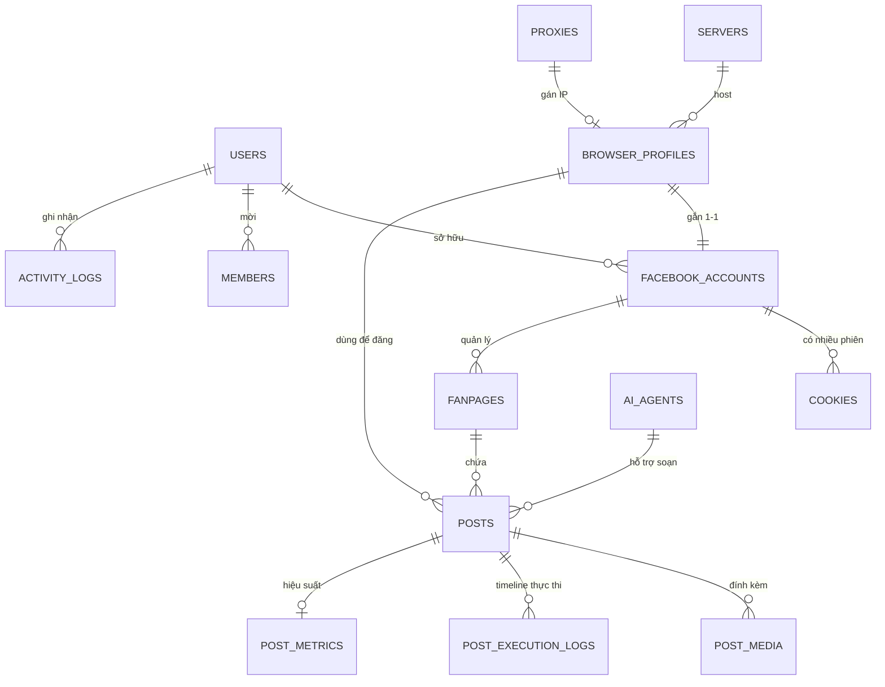

# PostMate — Phân tích hệ thống

> Tài liệu được dựng lại từ 9 màn giao diện trong thư mục `Design/`.
> Mục tiêu: mô tả cấu trúc CSDL, nghiệp vụ từng màn và cơ chế chống bị block khi Facebook quét/kiểm tra tự động hóa.

**PostMate** là công cụ **tự động đăng bài lên nhiều Fanpage Facebook**, kết hợp **AI Agent** soạn/gợi ý nội dung và **hàng đợi (queue)** để phân phối lịch đăng.

> **Định hướng kiến trúc đã chốt:** hệ thống triển khai theo mô hình **Hybrid, ưu tiên Graph API (API-first)** ở **quy mô nhỏ** — xem [mục 6](#6-kiến-trúc-triển-khai-đề-xuất--hybrid-api-first-quy-mô-nhỏ). Nhánh điều khiển **Chrome profile chống phát hiện (anti-detect)** trên máy chủ (mô tả ở mục 1 & 4) được giữ lại nhưng **chỉ đóng vai trò fallback** cho những thao tác Graph API không đáp ứng được.

---

## 1. Kiến trúc & thành phần chính

```
┌──────────────────────────────────────────────────────────────────┐
│                        PostMate (Web App)                          │
│   Dashboard · Tạo nội dung · Lịch đăng · Bài viết · Cài đặt         │
└───────────────┬────────────────────────────────────┬──────────────┘
                │ API                                 │
        ┌───────▼────────┐                   ┌────────▼─────────┐
        │  Orchestrator   │  đẩy job          │   AI Agent(s)     │
        │  + Queue        ├──────────────────▶│  (gợi ý nội dung) │
        └───────┬─────────┘                   └──────────────────┘
                │ phân phối job theo server/profile
   ┌────────────┼────────────┬─────────────────┐
   ▼            ▼            ▼                  ▼
Server 01    Server 02    Server 03      ...  (mỗi server chạy nhiều
(103.164.   (103.164.    (103.164.            Chrome instance headless)
 23.11)      23.22)       23.33)
   │            │            │
   ▼            ▼            ▼
Chrome #01   Chrome #03   Chrome #05      ← mỗi profile = 1 tài khoản FB
 (khanh01)    (minh03)     (tuananh)         + 1 cookie + 1 vân tay riêng
   │
   ▼
Facebook (đăng bài lên Fanpage liên kết)
```

Các thực thể cốt lõi:

| Thực thể | Vai trò |
|----------|---------|
| **Server** | Máy chủ vật lý/ảo, mỗi máy chạy nhiều Chrome instance (VD: 8 profile / 3 máy). |
| **Browser Profile (Chrome instance)** | Một hồ sơ trình duyệt cô lập: có vân tay (fingerprint), User-Agent, phiên bản Chrome, hệ điều hành riêng. Chạy chế độ Headless. |
| **Facebook Account** | Tài khoản FB gắn vào 1 profile, đăng nhập bằng cookie. |
| **Cookie** | Phiên đăng nhập FB (thay cho user/pass), có size, hạn dùng, IP đăng nhập. |
| **Fanpage** | Trang FB do tài khoản quản lý — nơi bài viết được đăng. |
| **Post / Bài viết** | Nội dung (text/ảnh/video/link/poll) + lịch đăng + trạng thái. |
| **AI Agent** | Sinh/gợi ý nội dung, caption, hashtag. |
| **Queue** | Hàng đợi phân phối job đăng bài theo thời gian & tải máy. |

---

## 2. Cấu trúc cơ sở dữ liệu (DB)

### 2.1. Sơ đồ quan hệ (ERD)



### 2.2. Chi tiết các bảng

#### `users` — Người dùng hệ thống
| Cột | Kiểu | Ghi chú |
|-----|------|---------|
| id | bigint PK | |
| full_name | varchar | VD: Khánh Nguyễn |
| email | varchar unique | |
| avatar_url | varchar | |
| role | enum(`admin`,`member`,`viewer`) | Màn Cài đặt: "Admin" |
| plan | varchar | VD: Business |
| fb_user_id | varchar | ID tài khoản: 100082391234567 |
| created_at / updated_at | timestamp | |

#### `servers` — Máy chủ
| Cột | Kiểu | Ghi chú |
|-----|------|---------|
| id | bigint PK | |
| name | varchar | Server 01/02/03 |
| ip_address | varchar | 103.164.23.11 |
| status | enum(`online`,`offline`) | |
| cpu_usage / ram_usage | float | Theo dõi tải máy |
| max_instances | int | Số profile tối đa/máy |

#### `browser_profiles` — Trình duyệt (Chrome instance)
| Cột | Kiểu | Ghi chú |
|-----|------|---------|
| id | bigint PK | |
| code | varchar | Chrome #01 |
| profile_name | varchar | khanh01 |
| profile_id | int | Profile ID: 1 |
| server_id | FK → servers | |
| proxy_id | FK → proxies | IP thoát riêng cho profile |
| facebook_account_id | FK → facebook_accounts | Gắn 1-1 |
| status | enum(`running`,`stopped`,`offline`) | Đang chạy / Đang dừng / Ngoại tuyến |
| mode | enum(`headless`,`gui`) | Headless |
| chrome_version | varchar | 124.0.6367.118 |
| os | varchar | Windows 11 |
| user_agent | text | Mozilla/5.0 (Windows NT 10.0…) |
| fingerprint_json | jsonb | Canvas, WebGL, fonts, timezone, screen… |
| cpu_percent / ram_mb | float/int | 6% / 312 MB |
| started_at | timestamp | Khởi chạy lúc 08:35 |
| last_active_at | timestamp | Lần hoạt động cuối |
| uptime_minutes | int | Thời gian hoạt động 40 phút |

#### `proxies` — IP/Proxy (suy ra từ "IP đăng nhập" mỗi tài khoản)
| Cột | Kiểu | Ghi chú |
|-----|------|---------|
| id | bigint PK | |
| ip | varchar | 103.171.12.45 |
| country | varchar | VN (🇻🇳) |
| type | enum(`residential`,`datacenter`,`mobile`) | |
| status | enum(`active`,`dead`) | |

#### `facebook_accounts` — Tài khoản Facebook
| Cột | Kiểu | Ghi chú |
|-----|------|---------|
| id | bigint PK | |
| owner_user_id | FK → users | |
| display_name | varchar | Khánh Nguyễn |
| email | varchar | khanh.nguyen@example.com |
| avatar_url | varchar | |
| browser_profile_id | FK → browser_profiles | |
| status | enum(`active`,`inactive`,`checkpoint`) | Đang hoạt động / Không hoạt động / Gặp vấn đề (Checkpoint) |
| last_login_at | timestamp | 23/05/2025 09:15 |
| last_login_ip | varchar | 103.171.12.45 |
| device | varchar | Windows 11 |
| user_agent | text | |
| capabilities | jsonb | đăng bài, upload ảnh/video, bình luận, trả lời comment, inbox |
| created_at / updated_at | timestamp | |

#### `cookies` — Phiên đăng nhập
| Cột | Kiểu | Ghi chú |
|-----|------|---------|
| id | bigint PK | |
| code | varchar | ck_01a7f9c3…d9b2 |
| facebook_account_id | FK → facebook_accounts | |
| browser_profile_id | FK → browser_profiles | |
| size_kb | float | 12.4 KB |
| status | enum(`valid`,`expiring`,`invalid`) | Hợp lệ / Sắp hết hạn / Không hợp lệ |
| expires_at | date | 20/06/2025 (còn 26 ngày) |
| last_login_at | timestamp | |
| last_login_ip | varchar | 103.171.12.45 🇻🇳 |
| device / user_agent | varchar/text | |
| cookie_blob | text (mã hóa) | Nội dung cookie thực (nên mã hóa at-rest) |

#### `fanpages` — Fanpage
| Cột | Kiểu | Ghi chú |
|-----|------|---------|
| id | bigint PK | |
| fb_page_id | varchar | 123456789012345 |
| name | varchar | Shoes Store |
| category | varchar | Mua sắm & Bán lẻ |
| url | varchar | facebook.com/shoesstore |
| facebook_account_id | FK → facebook_accounts | Tài khoản quản lý |
| browser_profile_id | FK → browser_profiles | |
| likes_count / followers_count | int | 23.5K / 24.1K |
| status | enum(`active`,`need_relogin`,`inactive`) | |
| can_post | boolean | "Có thể đăng" / "Không thể đăng" |
| capabilities | jsonb | đăng bài, bình luận, upload, trả lời comment, inbox |
| last_post_at | timestamp | |

#### `posts` — Bài viết / Lịch đăng
| Cột | Kiểu | Ghi chú |
|-----|------|---------|
| id | bigint PK | post_6824f9e3a1b2c |
| title | varchar | "BST giày thể thao mới nhất 2025" |
| content | text | Nội dung + hashtag (235 ký tự) |
| content_type | enum(`text`,`image`,`video`,`link`,`poll`) | |
| fanpage_id | FK → fanpages | |
| browser_profile_id | FK → browser_profiles | |
| ai_agent_id | FK → ai_agents (nullable) | |
| status | enum(`draft`,`scheduled`,`processing`,`published`,`failed`,`expired`,`deleted`) | |
| scheduled_at | timestamp | 23/05/2025 09:15 |
| published_at | timestamp | |
| attempt_count / max_attempts | int | "Lần thứ 1/3" |
| repeat_rule | varchar | "Không lặp lại" / cron |
| fb_post_id | varchar | 123456789012345_987654321 |
| note | text | Ghi chú (≤ 200 ký tự) |
| options | jsonb | auto_shorten_link, disable_comment_notif, auto_share |
| created_at / updated_at | timestamp | |

#### `post_media` — Media đính kèm
| Cột | Kiểu | Ghi chú |
|-----|------|---------|
| id | bigint PK | |
| post_id | FK → posts | |
| type | enum(`image`,`video`) | Tối đa 10 ảnh hoặc 1 video |
| url / storage_path | varchar | |
| order_index | int | Thứ tự hiển thị |

#### `post_execution_logs` — Timeline thực thi (màn Lịch đăng)
| Cột | Kiểu | Ghi chú |
|-----|------|---------|
| id | bigint PK | |
| post_id | FK → posts | |
| step | varchar | Mở trình duyệt · Truy cập Facebook · Đi tới fanpage · Điền nội dung · Tải ảnh · Click đăng · Đăng thành công |
| status | enum(`success`,`failed`) | |
| duration_sec | int | 2s, 3s, 4s, 12s… |
| logged_at | timestamp | 09:05 → 09:06 |

#### `post_metrics` — Hiệu suất bài viết (màn Bài viết)
| Cột | Kiểu | Ghi chú |
|-----|------|---------|
| post_id | FK → posts PK | |
| likes / comments / shares | int | 245 / 32 / 18 |
| reach | int | Lượt tiếp cận 5.2K |
| engagement | int | Lượt tương tác 3.1K |
| saves | int | Lượt lưu 156 |
| updated_at | timestamp | |

#### `ai_agents`
| Cột | Kiểu | Ghi chú |
|-----|------|---------|
| id | bigint PK | |
| name | varchar | |
| status | enum(`active`,`idle`) | "2 agent đang hoạt động" |
| model / config | jsonb | |

#### `activity_logs` — Nhật ký hoạt động
| Cột | Kiểu | Ghi chú |
|-----|------|---------|
| id | bigint PK | |
| user_id / entity_ref | FK | |
| type | varchar | Đăng bài, Khởi động Chrome, Refresh cookie, Tạo lịch… |
| message | text | "Đăng bài thành công — Shoes Store" |
| level | enum(`info`,`success`,`warning`,`error`) | |
| created_at | timestamp | |

#### `settings` — Cấu hình hệ thống (màn Cài đặt)
| Cột | Kiểu | Ghi chú |
|-----|------|---------|
| user_id | FK PK | |
| language | varchar | Tiếng Việt |
| timezone | varchar | GMT+07 Asia/Ho_Chi_Minh |
| default_fanpage_id | FK | Shoes Store |
| default_content_type | enum | Bài viết (ảnh + văn bản) |
| default_status | enum | Lên lịch |
| default_post_time | time | 09:00 |
| auto_shorten_link | bool | |
| auto_save_draft | bool | |
| show_ai_suggestions | bool | |
| confirm_before_post | bool | |
| storage_used / storage_limit | bigint | 2.45 GB / 10 GB |
| app_version | varchar | v1.2.0 |
| last_backup_at | timestamp | |

---

## 3. Nghiệp vụ từng màn

### 3.1. Dashboard (`homepage.png`)
**Mục đích:** tổng quan sức khỏe hệ thống trong khoảng thời gian chọn (23/05–23/06), tự cập nhật 30s.

- **5 thẻ KPI:** Tổng bài viết (352), Đã đăng thành công (298 · 84.7%), Chờ đăng (24), Đã lỗi (38), Đang xử lý (16) — kèm so sánh kỳ trước.
- **Biểu đồ hiệu suất đăng bài:** cột chồng theo ngày (thành công / chờ / lỗi).
- **Tỷ lệ trạng thái:** donut chart phân bổ theo trạng thái post.
- **Bài viết gần đây:** bảng post + fanpage + trình duyệt + thời gian + trạng thái.
- **Top fanpage:** xếp hạng theo lượt tương tác.
- **Trạng thái hệ thống:** AI Agent (2 đang chạy), Chrome Instances (8/10 chạy), Cookie (18/20 hợp lệ), Queue (12 bài đợi, ổn định), Hệ thống (tốt).
- **Nhật ký hoạt động:** stream sự kiện realtime.

> Đọc dữ liệu tổng hợp từ `posts`, `post_metrics`, `browser_profiles`, `cookies`, `activity_logs`, `queue`.

### 3.2. Tạo bài viết (`createContent.png`)
**Mục đích:** soạn nội dung và lên lịch đăng.

1. **Chọn nơi đăng:** chọn Fanpage + Chrome profile sẽ dùng (có thể thêm nhiều fanpage).
2. **Nội dung:** tab Văn bản / Ảnh / Video / Link / Poll; đếm ký tự; chèn emoji, hashtag, mention, biến (`{..}` spintax/placeholder); nút **Gợi ý AI**. Upload tối đa 10 ảnh hoặc 1 video (kéo-thả).
3. **Thiết lập đăng:** thời gian (Lên lịch / đăng ngay), ngày giờ, quy tắc lặp lại.
4. **Xem trước** giống giao diện Facebook thật.
5. **Thiết lập nâng cao:** trình duyệt sẽ dùng, tùy chọn (tự gắn link, tắt tin nhắn bình luận, tự chia sẻ), ghi chú (≤200).
6. **Thông tin kiểm tra:** trạng thái cookie, "Khả năng đăng: Có thể đăng", nút **Kiểm tra lại** (validate cookie/profile trước khi lưu).
7. Hành động: **Lưu nháp** / **Lên lịch**.

> Ghi vào `posts` (+`post_media`, `options`). Bước "Kiểm tra lại" validate `cookies.status` và `fanpages.can_post`.

### 3.3. Lịch đăng (`calendar.png`)
**Mục đích:** quản lý & theo dõi các post đã lên lịch.

- KPI: Tổng (128), Đã đăng (96), Chờ đăng (24), Đã lỗi (8), Hết hạn (0).
- Bộ lọc: trạng thái, fanpage, trình duyệt, khoảng ngày.
- Bảng: bài viết · fanpage · trình duyệt/profile · thời gian đăng · trạng thái · **Lần thử (1/3)** · tạo lúc.
- **Chi tiết bài viết** (panel phải): thông tin + **Timeline thực thi** từng bước với thời lượng (Mở trình duyệt 2s → Truy cập FB 3s → Đi tới fanpage 4s → Điền nội dung 5s → Tải ảnh 12s → Click đăng 2s → Đăng thành công).
- Thao tác: Xem trên Facebook, Nhân bản, Chỉnh sửa, Xóa.

> Đọc `posts` + `post_execution_logs`. "Hết hạn" = quá `scheduled_at` mà chưa chạy được.

### 3.4. Bài viết (`post.png`)
**Mục đích:** quản lý & theo dõi bài **đã đăng** và hiệu suất.

- KPI: Tổng (352), Thành công (298), Thất bại (38), Đang đăng (16), Đã xóa (0).
- Bảng có cột **Lượt tương tác** (like/comment).
- Chi tiết: thông tin post + tab **Timeline** + tab **Tương tác**; khối **Hiệu suất** (245 thích, 32 bình luận, 18 chia sẻ, 5.2K tiếp cận, 3.1K tương tác, 156 lưu).
- Thao tác: Xem trên FB, Đăng lại, Chỉnh sửa, Xóa; **Xuất dữ liệu**.

> Đọc `posts` + `post_metrics`. Metrics được đồng bộ định kỳ từ Facebook.

### 3.5. Tài khoản Facebook (`facebook.png`)
**Mục đích:** quản lý tài khoản FB dùng để đăng.

- KPI: Tổng (18), Đang hoạt động (14), Cookie sắp hết hạn (2 trong 7 ngày), Gặp vấn đề (2 cần kiểm tra).
- Bảng: tài khoản · trình duyệt/profile · trạng thái (Đang hoạt động/Không hoạt động/Gặp vấn đề–Checkpoint) · cookie (còn N ngày) · fanpage liên kết · lần đăng nhập · IP.
- Chi tiết: profile, cookie, IP đăng nhập (🇻🇳), thiết bị, User-Agent, **Khả năng** (đăng bài/upload/bình luận/inbox), tab Fanpage/Phiên đăng nhập/Nhật ký.
- Thao tác: **Đăng nhập lại**, Xóa tài khoản.

> `facebook_accounts` (+ `cookies`, `fanpages`). "Checkpoint" = FB yêu cầu xác minh → cần xử lý thủ công.

### 3.6. Fanpage (`fanpage.png`)
**Mục đích:** quản lý fanpage liên kết.

- KPI: Tổng (15), Đang hoạt động (12), Cần đăng nhập lại (2), Không hoạt động (1).
- Bảng: fanpage · tài khoản · trình duyệt · trạng thái · cookie · **Khả năng đăng bài** (Có thể/Không thể) · lần đăng gần nhất.
- Chi tiết: tên, danh mục, số thích/theo dõi, link, tài khoản quản lý, cookie, khả năng thực hiện.
- Thao tác: Chi tiết, Đăng nhập lại, **Gỡ liên kết**.

> `fanpages`. "Không thể đăng" khi cookie hết hạn / profile offline.

### 3.7. Trình duyệt (`browser.png`)
**Mục đích:** quản lý các Chrome profile chống phát hiện.

- KPI: Tổng (8 trên 3 máy), Đang chạy (6), Đang dừng (1), Ngoại tuyến (1).
- Bảng: trình duyệt · profile · tài khoản FB · **máy chủ + IP** · trạng thái · **tài nguyên CPU/RAM** · lần hoạt động gần nhất.
- Chi tiết: Profile ID, email, máy chủ, **chế độ Headless**, **phiên bản Chrome**, **hệ điều hành**, khởi chạy lúc, thời gian hoạt động, cookie, **User-Agent**.
- Thao tác: Mở, Khởi động lại, Dừng, Xóa, Khởi động.

> `browser_profiles` + `servers`. Là lớp thực thi anti-detect (xem mục 4).

### 3.8. Cookie (`cookies.png`)
**Mục đích:** quản lý cookie phiên đăng nhập.

- KPI: Tổng (18), Hợp lệ (14), Sắp hết hạn (2), Không hợp lệ (2).
- Bảng: cookie code · tài khoản · trình duyệt/profile · fanpage liên kết · trạng thái · **hết hạn (còn N ngày)** · lần đăng nhập cuối.
- Chi tiết: size, trạng thái, hết hạn, IP đăng nhập (🇻🇳), thiết bị, User-Agent.
- Hành động: **Đăng nhập**, **Xuất cookie**, **Làm mới cookie**, Xóa; nút **Làm mới** toàn bảng.

> `cookies`. "Làm mới cookie" = gia hạn phiên bằng cách mở profile và refresh session để tránh hết hạn.

### 3.9. Cài đặt (`setting.png`)
**Mục đích:** cấu hình hệ thống.

- Nhóm menu: Tổng quan · Tài khoản · Facebook (Fanpage, Token & Quyền) · Thông báo · AI & Nội dung · Lịch đăng · **Thành viên** · **Bảo mật** · **Thanh toán** · Nhật ký hoạt động.
- Thông tin tài khoản (vai trò Admin), Ngôn ngữ & Múi giờ.
- **Cài đặt mặc định khi tạo bài:** fanpage/loại nội dung/trạng thái/thời gian mặc định.
- **Tùy chọn hệ thống:** tự rút gọn link, tự lưu nháp, hiển thị gợi ý AI, xác nhận trước khi đăng (toggle).
- **Thông tin hệ thống:** phiên bản (v1.2.0), cập nhật cuối, máy chủ, **dung lượng (2.45/10 GB)**, **Sao lưu ngay**.

> `settings` (+ `members`, `users`).

---

## 4. Cơ chế tránh bị block khi bị Facebook quét

Facebook phát hiện tự động hóa qua nhiều tầng: **vân tay trình duyệt, hành vi, mạng (IP), tần suất, và tính nhất quán của phiên**. Chiến lược của PostMate là làm cho mỗi profile "trông giống một người thật, ổn định, đăng nhập từ một thiết bị/địa điểm cố định".

### 4.1. Cô lập & giả lập vân tay trình duyệt (fingerprint)
- **Mỗi Chrome profile là một môi trường cô lập** (cookie/localStorage/cache riêng) — thấy rõ ở `browser_profiles` (Profile ID, chế độ Headless).
- Mỗi profile có **vân tay riêng và cố định**: `chrome_version`, `os` (Windows 11), `user_agent`, cùng Canvas/WebGL/AudioContext/fonts/độ phân giải/timezone nhất quán (lưu ở `fingerprint_json`).
- **Nguyên tắc quan trọng: vân tay phải NHẤT QUÁN theo thời gian.** Một profile không được đổi User-Agent/độ phân giải/timezone giữa các phiên — thay đổi đột ngột là tín hiệu bot rõ nhất.
- User-Agent phải **khớp** với OS và phiên bản Chrome khai báo (không để UA nói "Windows" trong khi vân tay là Linux headless).
- Che dấu dấu hiệu headless (`navigator.webdriver=false`, vá `navigator.plugins`, `languages`, WebGL vendor…).

### 4.2. Ổn định mạng — 1 IP cho 1 tài khoản
- **Mỗi profile/tài khoản gán một proxy riêng, ổn định** (bảng `proxies`; UI cho thấy "IP đăng nhập 103.171.12.45 🇻🇳" cố định theo tài khoản).
- Ưu tiên **proxy residential/mobile cùng quốc gia** với lịch sử tài khoản (VN → IP VN). Tránh IP datacenter và tránh nhiều tài khoản dùng chung một IP.
- **Không đổi IP giữa các phiên** của cùng tài khoản — FB coi việc "nhảy IP/quốc gia" là dấu hiệu chiếm tài khoản → checkpoint.
- Timezone của trình duyệt phải khớp với vị trí địa lý của IP.

### 4.3. Quản lý phiên bằng cookie thay vì đăng nhập lại
- Đăng bài **bằng cookie phiên** (`cookies`) thay vì nhập user/pass mỗi lần → giảm số lần đăng nhập → giảm nghi ngờ.
- Theo dõi **hạn cookie** và cảnh báo "sắp hết hạn"; **Làm mới cookie** chủ động (mở profile, refresh session) thay vì để hết hạn rồi login lại từ đầu.
- Giữ cookie gắn với **đúng thiết bị/UA/IP** đã tạo ra nó (không "port" cookie sang máy khác cấu hình lệch).

### 4.4. Mô phỏng hành vi người thật
- **Timeline thực thi có độ trễ tự nhiên giữa các bước** (Mở trình duyệt 2s → Truy cập FB 3s → Đi tới fanpage 4s → Điền nội dung 5s → Tải ảnh 12s → Click đăng 2s). Đây chính là chống phát hiện: không thao tác tức thời.
- Nên bổ sung **jitter ngẫu nhiên** cho delay, gõ ký tự theo nhịp người, di chuột/scroll, dừng đọc trước khi click.
- **Điều hướng qua UI thật** (vào fanpage → composer → điền → đăng) thay vì gọi thẳng endpoint nội bộ.

### 4.5. Kiểm soát tần suất & phân phối tải (rate limiting)
- **Queue** phân phối bài đăng theo thời gian, tránh đăng dồn dập (12 bài trong hàng đợi, trạng thái "Ổn định").
- **Giãn lịch đăng** giữa các bài trên cùng fanpage/tài khoản; đặt hạn mức bài/giờ/ngày cho mỗi tài khoản.
- Phân tải nhiều profile trên **nhiều server** (8 profile / 3 máy) để không tập trung hành vi trên một máy/IP.
- Cơ chế **thử lại có kiểm soát** ("Lần thử 1/3"): giới hạn số lần retry, có backoff — không spam retry khi lỗi.

### 4.6. Giám sát tín hiệu rủi ro & phản ứng
- Trạng thái **Checkpoint / "Gặp vấn đề" / "Cần kiểm tra"** trên màn Tài khoản: khi FB yêu cầu xác minh → **tạm dừng tự động, chuyển xử lý thủ công**, không tiếp tục bơm hành động (tránh khóa cứng).
- Theo dõi **sức khỏe cookie** (hợp lệ/sắp hết hạn/không hợp lệ) và **profile offline** để ngừng đăng qua tài khoản đang rủi ro.
- **Nhật ký hoạt động** ghi lại mọi hành vi để truy vết khi bị quét/limit.
- Chạy **Headless nhưng cấu hình đầy đủ** (viewport, WebGL, media devices) để không lộ môi trường server trần.

### 4.7. Tóm tắt nguyên tắc "vàng"
| Tầng phát hiện của FB | Đối sách của PostMate |
|-----------------------|------------------------|
| Vân tay trình duyệt | Fingerprint riêng, **cố định & nhất quán** cho mỗi profile |
| Địa chỉ mạng | 1 tài khoản = 1 proxy sạch, cùng quốc gia, không đổi |
| Phiên đăng nhập | Dùng cookie, làm mới chủ động, gắn đúng thiết bị/IP |
| Hành vi | Delay tự nhiên + jitter, thao tác qua UI thật |
| Tần suất | Queue + rate limit + phân tải nhiều server |
| Tín hiệu rủi ro | Phát hiện checkpoint → dừng & xử lý tay, retry có backoff |

> **Lưu ý sử dụng hợp pháp:** các kỹ thuật trên nhằm giữ ổn định tài khoản khi quản lý **fanpage/doanh nghiệp của chính mình** ở quy mô lớn. Cần tuân thủ Điều khoản dịch vụ của Facebook và pháp luật; không dùng cho spam, giả mạo hay chiếm dụng tài khoản người khác.

---

## 5. Luồng đăng bài end-to-end (tổng hợp)

```
Tạo bài viết ──▶ Lưu (draft/scheduled) ──▶ Queue nhận job
     │                                          │
     ▼                                          ▼
Kiểm tra cookie + can_post              Đến giờ scheduled_at
     │                                          │
     └──────────────┬───────────────────────────┘
                    ▼
        Orchestrator chọn server/profile rảnh
                    ▼
   Mở Chrome profile (headless, proxy, fingerprint)
                    ▼
   Nạp cookie → Truy cập FB → Vào fanpage
                    ▼
   Điền nội dung → Upload media (delay tự nhiên)
                    ▼
              Click "Đăng"
        ┌─────────┴──────────┐
   Thành công            Thất bại
        │                     │
   fb_post_id            attempt < max? ──▶ retry (backoff)
   status=published           │
   ghi post_execution_logs    └─▶ status=failed / checkpoint → xử lý tay
        ▼
   Đồng bộ post_metrics (like/comment/reach) định kỳ
```

---

## 6. Kiến trúc triển khai đề xuất — Hybrid API-first (quy mô nhỏ)

> **Quyết định:** hệ thống đi theo hướng **Hybrid, ưu tiên Graph API (API-first)**, vận hành ở **quy mô nhỏ**. Đây là lựa chọn rẻ nhất, bền nhất và an toàn nhất về Điều khoản dịch vụ (ToS) của Facebook.

### 6.1. Nguyên tắc cốt lõi
- **API-first:** với Fanpage do người dùng **thực sự sở hữu**, mọi thao tác (đăng bài, ảnh, lên lịch, đọc metrics) đi qua **Meta Graph API** bằng Page Access Token. Không mở trình duyệt.
- **Browser chỉ là fallback:** chỉ dùng Chrome anti-detect cho phần API **không** làm được (hoặc tài khoản chưa cấp được token). Đây là ngoại lệ, không phải mặc định.
- **Quy mô nhỏ:** vài tài khoản / vài chục fanpage. Nhờ vậy chỉ cần **1 server** (thậm chí 1 máy), số Chrome instance giữ ở mức tối thiểu (chỉ chạy khi cần fallback).

### 6.2. Vì sao phù hợp quy mô nhỏ
| Tiêu chí | Kết quả |
|----------|---------|
| Chi phí hạ tầng | Rất thấp — không cần fleet Chrome/nhiều server; API là call HTTP nhẹ. |
| Độ bền | Cao — không vỡ vì FB đổi UI; không lệ thuộc selector. |
| An toàn ToS | Cao — dùng kênh chính thức, gần như không bị block/checkpoint. |
| Vận hành | Đơn giản — ít trạng thái, dễ quan sát, dễ khôi phục. |

### 6.3. Sơ đồ triển khai
```
                 PostMate (Web App)
                        │
         ┌──────────────┴───────────────┐
         ▼ (mặc định)                    ▼ (fallback, hiếm khi)
   Meta Graph API                 1 Chrome anti-detect profile
   - POST /{page-id}/feed         (chỉ bật khi API không đáp ứng
   - POST /{page-id}/photos        được thao tác cần thiết)
   - Scheduled post
   - GET insights (metrics)
         │                                │
         ▼                                ▼
     Facebook Pages ◀─────────────────────┘
```

### 6.4. Ranh giới: khi nào dùng API, khi nào dùng Browser
| Thao tác | Kênh |
|----------|------|
| Đăng text / ảnh / link / video lên Page mình sở hữu | **Graph API** |
| Lên lịch đăng (scheduled_publish_time) | **Graph API** |
| Lấy metrics (reach, engagement, like/comment/share) | **Graph API (Insights)** |
| Trả lời comment / inbox trên Page | **Graph API** (Conversations/Comments) |
| Thao tác API không hỗ trợ, hoặc account chưa có token/app-review | **Browser fallback** |

> Nếu một nhu cầu chỉ làm được bằng browser fallback và lặp lại thường xuyên, nên xem lại — thường có cách làm bằng API hoặc nên bỏ nhu cầu đó để giữ an toàn.

### 6.5. Ảnh hưởng tới CSDL (bổ sung so với mục 2)
Thêm khái niệm **token** và **kênh đăng** để phân biệt API vs browser:

- **Bảng mới `meta_app_credentials`** — cấu hình Meta App
  | Cột | Kiểu | Ghi chú |
  |-----|------|---------|
  | id | bigint PK | |
  | app_id | varchar | Meta App ID |
  | app_secret | varchar (mã hóa) | |
  | system_user_token | text (mã hóa) | Token dài hạn cấp cho các Page |

- **`fanpages`** — bổ sung:
  | Cột | Kiểu | Ghi chú |
  |-----|------|---------|
  | page_access_token | text (mã hóa) | Token đăng bài qua API |
  | token_expires_at | timestamp | Hạn token (theo dõi & làm mới) |
  | api_enabled | boolean | Page này đã sẵn sàng đăng qua API chưa |

- **`posts`** — bổ sung:
  | Cột | Kiểu | Ghi chú |
  |-----|------|---------|
  | channel | enum(`graph_api`,`browser`) | Kênh thực thi bài viết |

- **`settings`** — bổ sung:
  | Cột | Kiểu | Ghi chú |
  |-----|------|---------|
  | preferred_channel | enum(`graph_api`,`browser`) | Mặc định = `graph_api` |
  | allow_browser_fallback | boolean | Cho phép rơi về browser khi API không đáp ứng |

### 6.6. Ảnh hưởng tới giao diện
- **Cài đặt → Facebook (Fanpage, Token & Quyền):** thêm luồng **kết nối Meta App / cấp Page Access Token**, hiển thị hạn token và nút làm mới.
- **Fanpage / Bài viết:** thêm cột/nhãn **Kênh đăng** (API / Trình duyệt) để phân biệt.
- **Trình duyệt / Cookie:** vẫn giữ nhưng thu nhỏ vai trò — chỉ phục vụ fallback; ở quy mô nhỏ có thể chỉ còn 1–2 profile.
- **Cơ chế chống block (mục 4):** chỉ còn áp dụng cho nhánh fallback. Với nhánh API-first, rủi ro block gần như bằng 0 nên không cần fingerprint/proxy phức tạp.

### 6.7. Lộ trình áp dụng gọn
1. Đăng ký **Meta App**, xin quyền `pages_manage_posts`, `pages_read_engagement`, `pages_manage_engagement` (qua App Review).
2. Lấy **Page Access Token** cho từng Fanpage sở hữu → lưu vào `fanpages.page_access_token`.
3. Chuyển luồng "Lên lịch / Đăng ngay" gọi Graph API; đồng bộ metrics qua Insights.
4. Giữ lại **1 profile browser fallback** cho các trường hợp ngoại lệ; đặt `allow_browser_fallback` và cảnh báo khi nó được kích hoạt.

---

*Tài liệu suy luận từ giao diện — một số tên bảng/cột là đề xuất chuẩn hóa, có thể khác với cài đặt thực tế của backend.*
